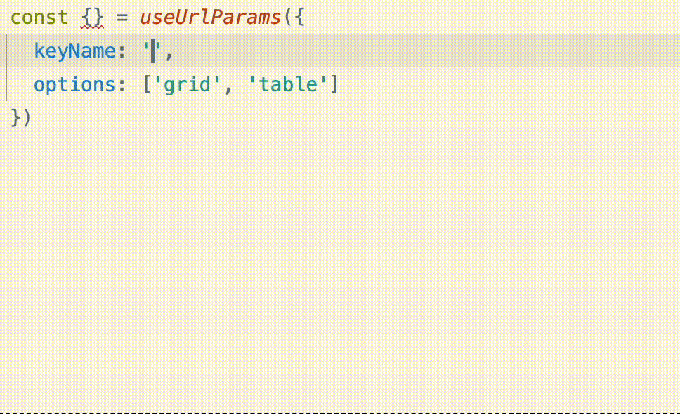

# useUrlParams

[](https://www.npmjs.com/package/react-url-query-params)
[](https://www.npmjs.com/package/react-url-query-params)
[](../../LICENSE)
[](https://github.com/PashaSchool/utils-kit/actions/workflows/CI.yml)


A lightweight React hook library for managing **URL query parameters** with full TypeScript support and auto-generated helper methods.

Built for [`react-router-dom`](https://reactrouter.com/) (v6+) with **type-safe keys**, **option validation**, and **handy helper flags**.

The library provides two hooks:
- **`useUrlParams`** - Manage a single query parameter
- **`useBulkUrlParams`** - Manage multiple query parameters at once

---

## Features

- **Type-safe** query parameter keys and values
- **Auto-generated helpers**: `set<Key>`, `toggle<Key>`, `is<Key><Option>`, `clear<Key>`
- **Toggle mode** for 2-option parameters
- Works seamlessly with `react-router-dom`’s `useSearchParams`
- Zero dependencies (except React & react-router-dom)

---

## Installation

```bash
npm install react-url-query-params
```
or
```bash
yarn add react-url-query-params
```
## Usage



### Single Parameter: `useUrlParams`

```tsx
import { useUrlParams } from 'react-url-query-params';

export default function MyComponent() {
  const { view, setView, toggleView, clearView, isViewGrid, isViewTable } = useUrlParams({
    keyName: 'view',
    options: ['grid', 'table'],
  });

  return (
    <div>
      <p>Current view: {view}</p>
      <button onClick={() => setView('grid')}>Grid</button>
      <button onClick={() => setView('table')}>Table</button>
      <button onClick={() => toggleView()}>Toggle</button>
      <button onClick={() => clearView()}>Clear</button>
      
      {/* Replace history entry instead of adding new one */}
      <button onClick={() => setView('grid', { replace: true })}>
        Grid (No History)
      </button>
      <button onClick={() => toggleView({ replace: true })}>
        Toggle (No History)
      </button>

      {isViewGrid && <div>Grid mode enabled</div>}
      {isViewTable && <div>Table mode enabled</div>}
    </div>
  );
}
``` 

### Multiple Parameters: `useBulkUrlParams`

```tsx
import { useBulkUrlParams } from 'react-url-query-params';

export default function MyComponent() {
  const { set, isViewGrid, isViewTable, isModalOpened, isModalClosed } = useBulkUrlParams({
    view: ['grid', 'table'],
    modal: ['opened', 'closed'],
  });

  return (
    <div>
      <button onClick={() => set({ view: 'grid', modal: 'opened' })}>
        Open Grid View
      </button>
      <button onClick={() => set({ view: 'table' })}>
        Switch to Table
      </button>

      {isViewGrid && <div>Grid mode enabled</div>}
      {isViewTable && <div>Table mode enabled</div>}
      {isModalOpened && <div>Modal is open</div>}
      {isModalClosed && <div>Modal is closed</div>}
    </div>
  );
}
```

---

## API Reference

### `useUrlParams(config)`

Manage a single query parameter with type-safe helpers.

**Config:**

| Option       | Type                              | Description |
|--------------|-----------------------------------|-------------|
| `keyName`    | `string`                          | Query parameter key |
| `options`    | `readonly string[]`               | Allowed values for this param |

**Returns:**
- `[keyName]` — current value (`string` or `null`)
- `set<Key>` — function to set a value
  - **First parameter**: The value to set
  - **Second parameter** (optional): `{ replace: boolean }` - Controls browser history behavior
    - `replace: false` (default) - Adds a new entry to browser history
    - `replace: true` - Replaces the current history entry
- `toggle<Key>` — toggle between 2 allowed values (only works if `options.length === 2`)
  - **Parameter** (optional): `{ replace: boolean }` - Controls browser history behavior
- `clear<Key>` — function to clear parameter from url
  - **Parameter** (optional): `{ replace: boolean }` - Controls browser history behavior
- `is<Key><Option>` — boolean helper for quick checks

**Example:**
```tsx
const { view, setView, toggleView, clearView, isViewGrid, isViewTable } = useUrlParams({
  keyName: 'view',
  options: ['grid', 'table'],
});

// Basic usage
setView('grid');
toggleView();
clearView();

// Control browser history
setView('grid', { replace: true });
toggleView({ replace: true });
clearView({ replace: true });
```

---

### `useBulkUrlParams(config)`

Manage multiple query parameters simultaneously with a single hook.

**Config:**

A record object where:
- **Keys** are the query parameter names (e.g., `'view'`, `'modal'`)
- **Values** are readonly arrays of allowed values (e.g., `['grid', 'table']`)


**Returns:**

- **`set`** — function to update one or more parameters at once
  - **First parameter**: A partial object of key-value pairs
  - **Second parameter** (optional): `{ replace: boolean }` - Controls browser history behavior
    - `replace: false` (default) - Adds a new entry to browser history
    - `replace: true` - Replaces the current history entry
  - Only updates the specified parameters, leaving others unchanged
- **`is<Key><Option>`** — boolean flags for each key-option combination
  - Automatically generated based on your config
  - Format: `is${Capitalize<Key>}${Capitalize<Option>}`
  - Example: For `view: ['grid', 'table']`, you get `isViewGrid` and `isViewTable`

**Examples:**

```tsx
// Basic usage
const { set, isViewGrid, isViewTable, clearParams } = useBulkUrlParams({
  view: ['grid', 'table'],
});

// Multiple parameters
const { set, isViewGrid, isViewTable, isModalOpened, isModalClosed, clearParams } = useBulkUrlParams({
  view: ['grid', 'table'],
  modal: ['opened', 'closed'],
});

// Update single parameter
set({ view: 'grid' });

// Update multiple parameters at once
set({ view: 'table', modal: 'opened' });

// Control browser history (replace current entry instead of adding new one)
set({ view: 'grid' }, { replace: true });

// Use boolean flags
if (isViewGrid && isModalOpened) {
  // Both conditions are true
}
```

**Advanced Example:**

```tsx
import { useBulkUrlParams } from 'react-url-query-params';

function FilterableTable() {
  const { set, isSortAsc, isSortDesc, isFilterActive, isFilterInactive, clearParams } = useBulkUrlParams({
    sort: ['asc', 'desc'],
    filter: ['active', 'inactive'],
  });

  return (
    <div>
      <button onClick={() => set({ sort: 'asc' })}>
        Sort Ascending {isSortAsc && '✓'}
      </button>
      <button onClick={() => set({ sort: 'desc' })}>
        Sort Descending {isSortDesc && '✓'}
      </button>
      <button onClick={() => set({ filter: 'active' })}>
        Show Active {isFilterActive && '✓'}
      </button>
      <button onClick={() => set({ filter: 'inactive' })}>
        Show Inactive {isFilterInactive && '✓'}
      </button>
      
      {/* Update both at once */}
      <button onClick={() => set({ sort: 'desc', filter: 'active' })}>
        Reset Filters
      </button>
      
      {/* Replace history entry (no back button navigation) */}
      <button onClick={() => set({ sort: 'asc' }, { replace: true })}>
        Sort Asc (No History)
      </button>
      
      
      <button onClick={() => clearParams()}>
        Clear all
      </button>
    </div>
  );
}
```

**Notes:**
- Use `as const` for the options arrays to get the best TypeScript inference
- The `clearParams` function will clear all params declared in hook
- The `set` function accepts an optional second parameter `{ replace: boolean }` to control browser history:
  - `replace: false` (default) - Adds a new entry to browser history (users can use back button)
  - `replace: true` - Replaces the current history entry (prevents back button navigation to previous state)
- Boolean flags are automatically generated and update reactively when URL changes
- All parameter names and values are type-safe based on your config

---


## Contributing

Contributions are welcome! Please feel free to submit a Pull Request.

---

## 📄 License

MIT © [Pavlo Kuzina](../../LICENSE)


## 🔗 Links

- **npm Package**: [react-csv-autopilot](https://www.npmjs.com/package/react-csv-autopilot)
- **Repository**: [GitHub - utils-kit](https://github.com/PashaSchool/utils-kit)
- **Issues**: [GitHub Issues](https://github.com/PashaSchool/utils-kit/issues)
- **Monorepo**: Part of [utils-kit](../../README.md) collection

---

## Related Packages

- [**react-csv-autopilot**](../react-csv-autopilot) - A React library for exporting large datasets to CSV with automatic pagination, streaming, and progress tracking. Built with Web Workers for non-blocking performance and File System Access API for efficient file writing

---

<div align="center">
  <sub>Built with ❤️ by <a href="https://github.com/PashaSchool">Pavlo Kuzina</a></sub>
</div>

